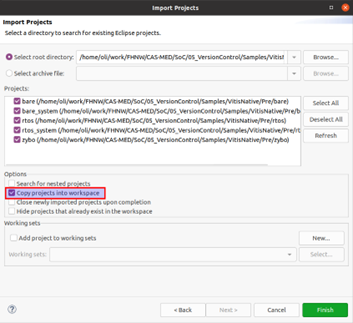

# Vitis In-Place Version Control

## Intro

For my teaching at FHNW, I checked if it is possible to version-control Vitis projects without manually writing TCL scripts. This might or might not be useful for Enclustra - I decided to share the knowledge anyways.

At FHNW the main motivation is that I do not want to teach students TCL plus all the vitis commands before they can work with GIT for their projects. Similar topics may apply to DS customers. I remember a case where PSTU had to update the TCL scripts whenever the custoemr sent us a new version of the project, which often contained changes in the BSP settings.

**Note:** The example is targeting Vitis 2023.1. It does not match the **new* Vitis (2023.2 and newer). The old GUI can still be used in 2023.2 by starting vitis as showne below:
```
vitis -classic
```

## Concept

In general, the idea is to follow the standard approach of version control: Write a .gitignore file, which does ensure only the really needed project files are checked in. 

Xilinx does not provide much information about which files must be checked in (or only useless information saying "check-in all files"). Hence I sorted out what files are needed myself.

Vitis has some absolute paths, therefore out-of-the-box above approach does not work. To fix this, I wrote a little TCL script to bring the whole work-space into a clean state after checkout (after paths changed).

## Initialization 

The following steps must be executed to check-in a workspace into version control:
1. Copy the workspace folder into a version controlled location
   * Better: Create the workspace in a version controlled location
2. Copy the *.gitignore* file [./ws/.gitignore](./ws/.gitignore) into the workspace root folder
3. Add the *regenerate.tcl* file [./ws/regenerate.tcl](./ws/regenerate.tcl) into the workspace root folder
4. Commit / push all files not ignored by the *.gitignore*

## Clone
The following steps must be executed after a fresh clone:
1. Open a new empty workspace in vitis
2. Menu: *File > Import*
3. Select *Eclipse workspace of zip file*
4. Import projects
   * Select all projects
   * **Remove the checkbox _Copy Projects into Workspace_** - all sources are left and edited in their original and version controlled location
   * 
5. Menu: *Xilinx > XSDC Console*
   * CD into workspace root folder
   * ```source regenerate.tcl```

## Modfiy

After modifications, no special steps are required. Just commit/push the changes.

Ideally you do avoid committing modified project files (changed absolute paths) if you did not change anything in the project settings.
